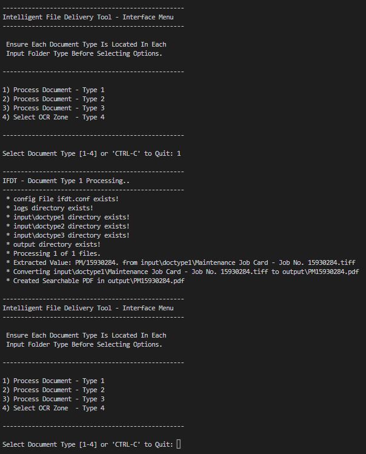
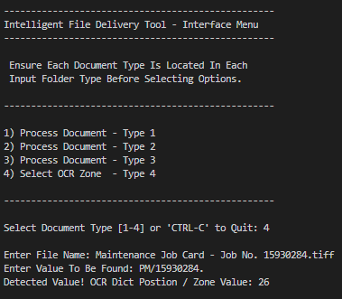

# Intelligent File Delivery Tool - Proof Of Concept
 - This console tool was designed to OCR documents, extract a value, and save the document as a searchable PDF with the extracted value as document name.

## Table of Contents
* [General Info](#general-information)
* [Technologies Used](#technologies-used)
* [Features](#features)
* [Screenshots](#screenshots)
* [Setup](#setup)
* [Usage](#usage)
* [Contact](#contact)

## General Information
- This PoC was developed for the requirements of a customer in the UK&I.
- The purpose of this PoC Tool is to enable the customer to take 3 x document types (Invoice, Proof of Delivery, Bill Of Materials for example), detect a value in each document type and save the document as a searchable PDF with the extracted value as the document name.
- This PoC tool also has the function of detecting the OCR Dict / Zone value. This is then defined in the IFDT.conf file for OCR operations.

## Technologies Used
- Python - version 3.10.5 - https://docs.python.org/3/
    - Modules - https://docs.python.org/3/tutorial/modules.html
        - pytesseract - https://docs.python.org/3/library/csv.html#module-csv
        - os - https://docs.python.org/3/library/os.html#module-os
        - os.path - https://docs.python.org/3/library/os.path.html
        - datetime - https://docs.python.org/3/library/datetime.html
        - configparser - https://docs.python.org/3/library/configparser.html
        - cv2 - https://pypi.org/project/opencv-python/

## Features
The tool provides the following capabilities:

- OCR of documents stored in seperate document type folders in TIFF format.
- OCR Document, extract value and save document based on extracted value.
- OCR Documents are output as searchable PDF.
- Output of logging for all functions to txt file.

## Screenshots

## Setup

* Setup the project from source files;

    - Download and install Python 3.10.5 from https://www.python.org/downloads/

    - Ensure Python is added to environment SYS Path.

    - Install deps from the provided requirements.txt file as per below;
 
        - pip3 install -r requirements.txt

## Usage
* Running the project from source files;

    - Ensure all Dependencies are installed.
    - Populate the conf file as per the example entry provided. 
    - Run 'python ifdt.py'
    - Check Output dir for output and logs for errors. 

## Contact
Created by James Dunne - James.Dunne1@gmail.com
